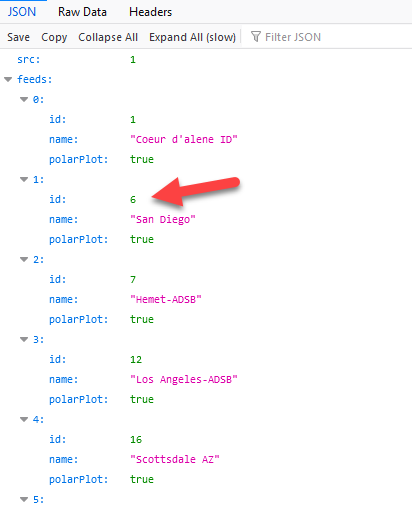

# Flows to work with the JSON data provided by VRS (Virtual Radar Server).   
   
Navigation: [home](README.md)  

One of the first things to do is to install a JSON pretty print extension in your web browser of choice. It will make working with the VRS feeds (called receivers) a lot easier to see and drill into.   
Each receiver has a feed ID, you will need that feed ID if you want to drill into your Jaero feeds and use Node-RED to look at the numbers of aircraft each satellite channel is carrying.    
Of course, there is also nothing stopping you from just looking the total of all the feeds and calling it a day.  
Here is what the feed ID list looks like when expanded a bit in your browser:   
   
   
Don't confuse the JSON ID with the VRS feed ID. In the image above, if you want San Diego data, you need feed id 6, NOT 1.   
The way you use this ID then is in the URL. So in my case, I run Node-RED on the same Windows PC as VRS, so my URL becomes http://127.0.0.1:8880/virtualradar/AircraftList.json?feed=6   
If you put that URL in your browser, you will see just the JSON data for the aircraft on the San Diego VRS receiver.   
Now we know how to get the data out of VRS, here is an example flow to get the number of aircraft from a given feed ID.   
    
    [{"id":"b24a29ba.9d5988","type":"debug","z":"f5085c14.6520b","name":"","active":false,"tosidebar":true,"console":false,"tostatus":false,"complete":"payload.totalAc","targetType":"msg","statusVal":"","statusType":"auto","x":3000,"y":660,"wires":[]},{"id":"c123ae76.e0fe7","type":"inject","z":"f5085c14.6520b","name":"120 sec","props":[{"p":"payload"},{"p":"topic","vt":"str"}],"repeat":"120","crontab":"","once":false,"onceDelay":"","topic":"","payload":"beno","payloadType":"str","x":2520,"y":660,"wires":[["6364499.2b41d38"]]},{"id":"6364499.2b41d38","type":"http request","z":"f5085c14.6520b","name":"VRS feed 6 aircraft count","method":"GET","ret":"obj","paytoqs":"ignore","url":"http://127.0.0.1:8880/virtualradar/aircraftlist.json?feed=6","tls":"","persist":false,"proxy":"","authType":"","x":2750,"y":660,"wires":[["b24a29ba.9d5988"]]}]   
That will give you the aircraft count every 2 minutes.  

Just to put a wrinkle in things, some people set up their VRS with gzip payload compression enabled, and in this case we need to give Node-RED a little more help to get the data into JSON.  
Add to your Node-RED pallet this gzip node here: https://flows.nodered.org/node/node-red-contrib-gzip  

Here is a flow that uses this node. Same as the previous flow, it injects every 2 minutes, doees a HTTP get on the VRS server, returns a binary buffer, ungzips it and puts it back in JSON using the core JSON node:   
   
    [{"id":"b24a29ba.9d5988","type":"debug","z":"f5085c14.6520b","name":"","active":false,"tosidebar":true,"console":false,"tostatus":false,"complete":"payload.totalAc","targetType":"msg","statusVal":"","statusType":"auto","x":3160,"y":680,"wires":[]},{"id":"c123ae76.e0fe7","type":"inject","z":"f5085c14.6520b","name":"120 sec","props":[{"p":"payload"},{"p":"topic","vt":"str"}],"repeat":"120","crontab":"","once":false,"onceDelay":"","topic":"","payload":"beno","payloadType":"str","x":2320,"y":680,"wires":[["6364499.2b41d38"]]},{"id":"6364499.2b41d38","type":"http request","z":"f5085c14.6520b","name":"VRS feed 6 aircraft count","method":"GET","ret":"bin","paytoqs":"ignore","url":"http://127.0.0.1:8880/virtualradar/aircraftlist.json?feed=6","tls":"","persist":false,"proxy":"","authType":"","x":2550,"y":680,"wires":[["fed76c1.0c73b9"]]},{"id":"fed76c1.0c73b9","type":"gzip","z":"f5085c14.6520b","name":"","x":2770,"y":680,"wires":[["7228b367.5a0974"]]},{"id":"7228b367.5a0974","type":"json","z":"f5085c14.6520b","name":"","property":"payload","action":"obj","pretty":false,"x":2920,"y":680,"wires":[["b24a29ba.9d5988"]]}]

I would strongly recommend that you keep track of the number of aircraft you see. Put it in a database, plot it on a graph. (Google will guide you to websites that show how to set up Node-RED to do such things).

Now that we can do that, we can start to dig into the JSON a bit more.  

